# 量化工具开发计划

## 整体计划

- [ ] 数据本地化
  - 存储方式
     -  [ ] 表结构设计
        -  [ ] 历史数据表 的 **命名规则**：`history_data_{period}` ，日线级别为 `period` 为 `'1d'`，表名：`history_data_1d`
        
        -  [ ] 扫雷宝分数，放在 `history_data_1d` 中。
        
        -  字段统计
           > 字段的图示：
           >
           > - ✅ 股票
           > - 🍄 期货
           > - ❌ 重复或暂未考虑使用
           > - ❓ 不明所以
           > - 🍒 在 `get_market_data_ex` 中可获得（应该放在日线级别的数据中可提高计算效率）
           > - 🔢 可通过计算获得（应该放在日线级别的数据中可提高计算效率）
           
           -  由 `xtdata.get_instrument_detail()` 返回的：
           
              |       | 字段名                        | 类型  | 意义                                                         | 股票例子   | 期货例子 |
              | ----- | ----------------------------- | ----- | ------------------------------------------------------------ | ---------- | -------- |
              | ✅     | ExchangeID                    | str   | 合约市场代码                                                 | SZ         | CZCE     |
              | ✅     | InstrumentID                  | str   | 合约代码                                                     | 002415     | FG512    |
              | ✅     | InstrumentName                | str   | 合约名称                                                     | 海康威视   | 玻璃2512 |
              | 🍄     | ProductID                     | str   | 合约的品种ID(期货)                                           |            | FG       |
              | 🍄     | ProductName                   | str   | 合约的品种名称(期货)                                         |            | 玻璃     |
              | ❓     | ProductType                   |       |                                                              | None       | None     |
              | ❌重复 | ~~ExchangeCode~~              | str   | 交易代码                                                     | 002415     | FG512    |
              | ❌重复 | ~~UniCode~~                   | str   | 唯一（交易）代码                                             | 002415     | FG512    |
              | 🍄     | CreateDate                    | str   | 上市日期(期货)                                               | 0          | 20241216 |
              | ✅🍄    | OpenDate                      | str   | IPO日期(股票)                                                | 20100528   | 20241216 |
              | ✅🍄    | ExpireDate                    | int   | 退市日或者到期日                                             | 99999999   | 20251212 |
              | ❓     | TradingDay                    |       |                                                              | None       |          |
              | 🍒日线 | ~~PreClose~~                  | float | 前收盘价格                                                   | 31.5       | 1037.0   |
              | 🍒日线 | ~~SettlementPrice~~           | float | 前结算价格                                                   | 31.5       | 1047.0   |
              | 🔢     | ~~UpStopPrice~~               | float | 当日涨停价                                                   | 34.65      | 1142.0   |
              | 🔢     | ~~DownStopPrice~~             | float | 当日跌停价                                                   | 28.35      | 952.0    |
              | ✅     | FloatVolume                   | float | 流通股本                                                     | 9046433602 | 0        |
              | ✅     | TotalVolume                   | float | 总股本                                                       | 9164871550 | 0        |
              | 🍄     | ~~LongMarginRatio~~           | float | 多头保证金率                                                 | 0          | 0.1      |
              | 🍄     | ~~ShortMarginRatio~~          | float | 空头保证金率                                                 | 0          | 0.1      |
              | ✅🍄    | PriceTick                     | float | 最小价格变动单位                                             | 0.01       | 1.0      |
              | 🍄     | ~~VolumeMultiple~~            | int   | 合约乘数(对期货以外的品种，默认是1)                          | 1          | 20       |
              | 🍄     | ~~MainContract~~              | int   | 主力合约标记，1、2、3分别表示第一主力合约，第二主力合约，第三主力合约 | 0          | 6        |
              | ❌     | ~~LastVolume~~                | int   | 昨日持仓量                                                   | 0          | 12579    |
              | ✅     | InstrumentStatus              | int   | 合约停牌状态，0：正常；1：停牌；-1：当日起复牌               | 0          |          |
              | 🍄     | ~~IsTrading~~                 | bool  | 合约是否可交易                                               | FALSE      | true     |
              | 🍄     | ~~IsRecent~~                  | bool  | 是否是近月合约                                               | False      | true     |
              | ❌     | ~~ProductTradeQuota~~         |       |                                                              | 0          |          |
              | ❌     | ~~ContractTradeQuota~~        |       |                                                              | 0          | 25000    |
              | ❌     | ~~ProductOpenInterestQuota~~  |       |                                                              | 0          |          |
              | ❌     | ~~ContractOpenInterestQuota~~ |       |                                                              | 0          | 5000     |
           
              ==结论==：由于股票和期货的差异，把数据拆分成2个表：`StockInstumentDetail` 和 `FutureInstumentDetail`。
           
           - 由 `xtdata.get_market_data_ex()` 返回的：
           
             |      | 字段名                                                | 类型  | 意义       | 例子          |
             | ---- | ----------------------------------------------------- | ----- | ---------- | ------------- |
             |      | time                                                  | str   | 时间（戳） | 1750867200000 |
             |      | open                                                  | float | 开盘价     | 27.80         |
             |      | high                                                  | float | 最高价     | 27.98         |
             |      | low                                                   | float | 最低价     | 27.54         |
             |      | close                                                 | float | 收盘价     | 27.59         |
             |      | volume                                                | float | 成交量     | 314808        |
             |      | amount                                                | float | 成交额     | 8.716268e+08  |
             | ❌    | ~~settelementPrice~~（拼写错误）<br />settlementPrice | float | 今结算     | 0.0           |
             |      | openInterest                                          | float | 持仓量     | 15            |
             |      | preClose                                              | float | 前收价     | 27.81         |
             |      | suspendFlag                                           | int   | 停牌标记   | 0             |
           
           
        
     -  [x] TDEngine
     
     -  [ ] csv
     
     -  [x] SQLite
     
  - 数据内容（**标有 :star: 为 无法从QMT中直接获取的数据列**）
    - [x] :star:扫雷宝
      - [x] 研究：如何获取扫雷宝数据
      - [x] 扫雷宝 json（详细字段）存于 TDEngine 的 `slb_detail` 表中。
        - [x] SQLite
        - [ ] PostgreSQL
        - [ ] TDEngine：官网例子都跑不通，不想玩了。
      - [ ] 扫雷宝**分数** 存于 `history_data_1d` 的 `扫雷宝分数` 字段中。
      - [x] 每天盘后更新扫雷宝 json 和 分数。
      - [ ] TODO：扫雷宝分数应该直接用 redis 缓存（提速）测试和 TDEngine 的速度差异。
    - [ ] :star:财务数
    - [ ] 日线
    - [ ] 1/5/10/30分钟
      - [ ] Redis +后台程序（订阅最近关心的、或者昨日已符合战法的、或许扫雷宝分数靠前等等条件的个股）一直更新最新缓存
    
  - 数据来源
    - [ ] 研究：直接读取通达信或同花顺下载后的本地文件（省去csv、SQLite）
      - [ ] 研究：如何用 python 读取通达信本地日线、财务数据
      - [ ] 研究：如何用 python 读取同花顺本地日线、财务数据
      
    - [ ] QMT/miniQMT
    
    - [ ] tushare
    
      - :book: 官网文档：[获取日线行情](https://hestudy.github.io/tushare-sdk/api/stock/daily.html)
      - TuShare 0.26 Documentation：http://tushare.org/TuShare/index.html
    
      - [x] TOKEN
      - [ ] 代码（python）：参考：https://www.heywhale.com/mw/project/666bb066a248f671bbc522f1

### 细分方案

- miniQMT + 无法从 QMT 中获得的本地化数据

## 具体实施（优先级以 🚩 数量标注）

### 1. 把 **无法直接从QMT获取的数据** 存于本地

包括：

- [x] 🚩🚩🚩扫雷宝分数（一天一存储）

- [x] 财务数据项（研究如何读取 通达信、同花顺 即可，能省去本地化数据冗余）

  - [x] `tdx_quant` 
    - `get_financial_data`：获取专业财务数据
    - `get_financial_data_by_date`：获取指定日期专业财务数据

- [x] 在【行情报价】列表中，获取扫雷宝数据（可排序）

  > :star2:==【自定义序列(字符串,数值)】用于【行情报价】表列==
  >
  > 入口：【市场】菜单→在列名处点击右键，从弹出菜单点击 `选择自选数据...`：
  >
  > 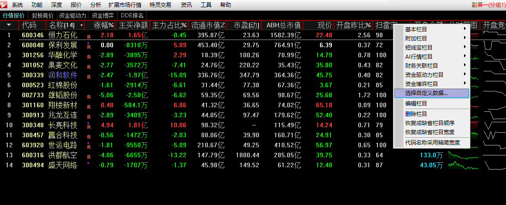
  >
  > 点【新建】后双击即可【导入】文件：
  >
  > 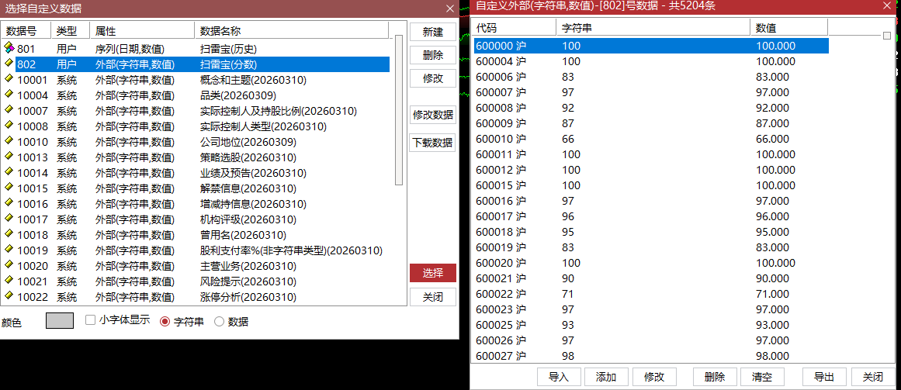
  >
  > 点击【选择】按钮添加到列中。
  >
  > - 文件格式：
  >
  >   ```ini
  >   1|605006|85|85.000
  >   0|002176|82|82.000
  >   ```
  >
  > - [ ] 利用 `slb_to_file.py` 来爬扫雷宝数据，导出【自定义序列】文件，再使用通达信导入。

- [ ] 在【指标】中，获取扫雷宝数据

  > :star2:==【自定义序列(日期,数值)】用于 指标==
  >
  > 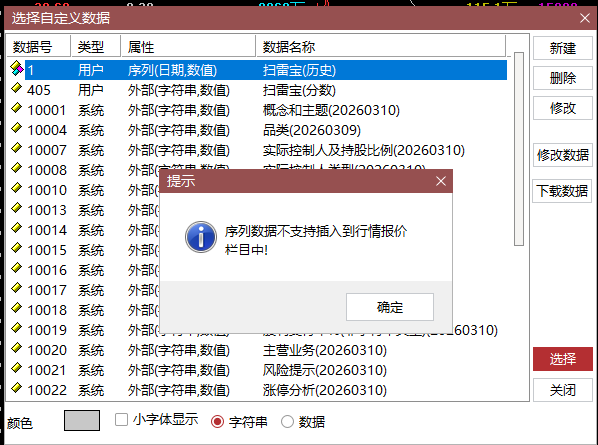
  >
  > 
  >
  > 

### 2. 基础设施🚩🚩🚩

- 数据读写层：

  - [ ] 写入 TDEngine
  
    建表语句：
  
    ```sql
    
    CREATE TABLE IF NOT EXISTS history_data_1d (
        ts TIMESTAMP,
        ExchangeID NCHAR(10),
        InstrumentID NCHAR(20),
        InstrumentName NCHAR(50),
        ProductID NCHAR(20),
        ProductName NCHAR(50),
        ProductType NCHAR(20),
        ExchangeCode NCHAR(20),
        UniCode NCHAR(20),
        CreateDate NCHAR(8),
        OpenDate NCHAR(8),
        ExpireDate BIGINT,
        TradingDay NCHAR(8),
        PreClose DOUBLE,
        SettlementPrice DOUBLE,
        UpStopPrice DOUBLE,
        DownStopPrice DOUBLE,
        FloatVolume DOUBLE,
        TotalVolume DOUBLE,
        LongMarginRatio DOUBLE,
        ShortMarginRatio DOUBLE,
        PriceTick DOUBLE,
        VolumeMultiple INT,
        MainContract INT,
        LastVolume INT,
        InstrumentStatus INT,
        IsTrading BOOL,
        IsRecent BOOL,
        ProductTradeQuota DOUBLE,
        ContractTradeQuota DOUBLE,
        ProductOpenInterestQuota DOUBLE,
        ContractOpenInterestQuota DOUBLE,
        open DOUBLE,
        high DOUBLE,
        low DOUBLE,
        close DOUBLE,
        volume DOUBLE,
        amount DOUBLE,
        settelementPrice DOUBLE,
        openInterest DOUBLE,
        suspendFlag INT,
        `slb.score` INT
    );
    ```
  
    带备注：
  
    ```sql
    
    CREATE TABLE IF NOT EXISTS history_data_1d (
        ts TIMESTAMP COMMENT '时间戳',
        ExchangeID NCHAR(10) COMMENT '合约市场代码',
        InstrumentID NCHAR(20) COMMENT '合约代码', 
        InstrumentName NCHAR(50) COMMENT '合约名称',
        ProductID NCHAR(20) COMMENT '合约的品种ID(期货)',
        ProductName NCHAR(50) COMMENT '合约的品种名称(期货)',
        ProductType NCHAR(20) COMMENT '产品类型',
        ExchangeCode NCHAR(20) COMMENT '交易代码',
        UniCode NCHAR(20) COMMENT '唯一（交易）代码',
        CreateDate NCHAR(8) COMMENT '上市日期(期货)',
        OpenDate NCHAR(8) COMMENT 'IPO日期(股票)',
        ExpireDate BIGINT COMMENT '退市日或者到期日',
        TradingDay NCHAR(8) COMMENT '交易日',
        PreClose DOUBLE COMMENT '前收盘价格',
        SettlementPrice DOUBLE COMMENT '前结算价格',
        UpStopPrice DOUBLE COMMENT '当日涨停价',
        DownStopPrice DOUBLE COMMENT '当日跌停价',
        FloatVolume DOUBLE COMMENT '流通量',
        TotalVolume DOUBLE COMMENT '总量',
        LongMarginRatio DOUBLE COMMENT '多头保证金率',
        ShortMarginRatio DOUBLE COMMENT '空头保证金率',
        PriceTick DOUBLE COMMENT '最小变动价位',
        VolumeMultiple INT COMMENT '合约乘数',
        MainContract INT COMMENT '主力合约标识',
        LastVolume INT COMMENT '最新成交量',
        InstrumentStatus INT COMMENT '合约状态',
        IsTrading BOOL COMMENT '是否交易中',
        IsRecent BOOL COMMENT '是否为近期合约',
        ProductTradeQuota DOUBLE COMMENT '品种交易额度',
        ContractTradeQuota DOUBLE COMMENT '合约交易额度',
        ProductOpenInterestQuota DOUBLE COMMENT '品种持仓额度',
        ContractOpenInterestQuota DOUBLE COMMENT '合约持仓额度',
        open DOUBLE COMMENT '开盘价',
        high DOUBLE COMMENT '最高价',
        low DOUBLE COMMENT '最低价',
        close DOUBLE COMMENT '收盘价',
        volume DOUBLE COMMENT '成交量',
        amount DOUBLE COMMENT '成交额',
        settelementPrice DOUBLE COMMENT '结算价',
        openInterest DOUBLE COMMENT '持仓量',
        preClose DOUBLE COMMENT '前收盘价',
        suspendFlag INT COMMENT '停牌标志',
        `slb.score` INT COMMENT 'SLB评分'
    );
    ```
  
    
  
- [ ] 读取 TDEgine
  
  - [ ] 写入 csv
  
- [ ] 读取 csv

- [ ] :star: 使用 QMT tick 来实时更新行情数据读写 redis

# 研究方向

- [ ] 数据源

  - [x] QMT、miniQMT

  - [ ] rainx/pytdx：[官网文档](https://rainx.gitbooks.io/pytdx/content/)，

    - 最后维护时间：2020-3-3

  - [ ] simple-pytdx：国金自带资料中翻找得到，简易版的 pytdx。

  - [ ] mootdx：使用到包括 pytdx 在内的众多库

    - 最后维护时间：2024-07-16

  - [ ] **🌟QUANTAXIS**：支持任务调度 分布式部署的 股票/期货/期权 数据/回测/模拟/交易/可视化/多账户 纯本地量化解决方案

    > ## 🌟 新特性 (v2.1.0)
    >
    > ### ⚡ QARS2 Rust核心集成 - 性能飞跃
    >
    > - **100x账户操作加速**: 创建账户从50ms降至0.5ms
    > - **10x回测速度提升**: 10年日线回测从30秒降至3秒
    > - **90%内存优化**: 大规模持仓内存占用降低90%
    > - **无缝集成**: 完全兼容QIFI协议，自动回退Python实现
    >
    > ### 🔧 Python 3.9-3.12 现代化
    >
    > - **依赖升级**: 60+核心依赖现代化 (pymongo 4.10+, pandas 2.0+, pyarrow 15.0+)
    > - **性能优化**: 利用Python 3.11+的性能提升
    > - **类型安全**: 更好的类型提示支持

    - 源码：https://github.com/yutiansut/QUANTAXIS.git
    - yutiansut（QUANTAXIS 的作者）从 2017-07-13 ~ 2019-08-26 一直参与 rainx/pytdx 项目的研发，可见 QUANTAXIS 是在 pytdx 停更后的延续。 
    - 维护时间：2024-07-16 ~ 2025-10-26

- [ ] 缓存机制

  - [ ] SQLite

  - [ ] pandas-datareader：

    - https://github.com/pydata/pandas-datareader

    - :star: **亮点：**首次请求时，将响应数据存储在本地数据库（默认使用 SQLite）
    - :book: [pandas-datareader缓存机制详解：提升数据获取效率的实用技巧](https://blog.csdn.net/gitblog_00260/article/details/148755458)

- [x] ## 🏗️ AI

  - [ ] fidy
    - 参考：[Dify插件开发实践：构建基于AKShare的股票数据工具](https://blog.csdn.net/u013589834/article/details/151919762)
  - [ ] n8n
  - [ ] coze
  - [ ] QWen
  - [ ] [daily_stcok_analysis](https://github.com/ZhuLinsen/daily_stock_analysis)：LLM驱动的 A/H/美股智能分析器，多数据源行情+实时新闻+Gemini决策仪表盘+多渠道推送

- [ ] 回测

  - [ ] [Zipline](https://github.com/quantopian/zipline)：是一个强大的开源库，专门用于量化交易策略的开发、测试和执行。
  - [ ] pandas-datareader缓存机制详解：提升数据获取效率的实用技巧

- [ ] 筹码峰研究
  - https://zhuanlan.zhihu.com/p/188474245
  - :star2: python仿通达信的量化函数库模块—— `fengwo`。 官网：https://fengwo.run/

- [ ] 开源量化模型

  - [ ] 阿布量化：https://github.com/bbfamily/abu

  - [ ] OSkhQuant：https://github.com/khscience/OSkhQuant

    优点：基于 miniQMT 做数据源

- 参考

  - [【推荐收藏】倾心整理的Python量化资源大合集](https://cloud.tencent.com/developer/article/1589337)

    > 
    >
    > ### python量化交易
    >
    > 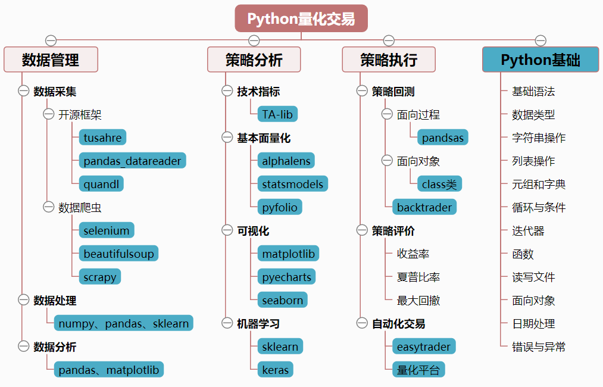


# 环境搭建

| 软件名                 | 版本      | 端口          | 说明                                                         |
| ---------------------- | --------- | ------------- | ------------------------------------------------------------ |
| python                 | 3.12.7    |               |                                                              |
| 国金miniQMT（xtquant） |           | 58610         |                                                              |
| ❌ ~~TDEngine~~         |           | ~~6030,6041~~ | 有试用期，且license昂贵。果然是坑钱的国产替代。<br />==且只有linux版本，而且官网例子(python)也无法跑通！== |
| PostgreSQL             | 18        | 5433          | 居然有windows版本，且免费。                                  |
| TdxQuant（tq_center）  | 2026.2.12 | 14571         | （利用 TCPView观察）通达信个人量化接口                       |


# 基础规则

## 证券代码

> 参考：《迅投QMT极速策略交易系统_模型资料_Python_API_说明文档_Python3.pdf》5.1. 附录1 市场简称代码

| 市场           | 代码 |
| -------------- | ---- |
| 上证所         | SH   |
| 深交所         | SZ   |
| 大商所         | DF   |
| 郑商所         | ZF   |
| 上期所         | SF   |
| 中金所         | IF   |
| 沪港通         | HGT  |
| 深港通         | SGT  |
| 外部自定义市场 | ED   |

# 思路

## AI

### 🌟daily_stcok_analysis

> https://github.com/ZhuLinsen/daily_stock_analysis
>
> LLM驱动的 A/H/美股智能分析器，多数据源行情 + 实时新闻 + Gemini 决策仪表盘 + 多渠道推送，零成本，纯白嫖，定时运行

#### 配置

- ==【新闻舆情】==博查：https://open.bochaai.com/ ，可申请API KEY，免费web search API 1000次，本项目每只股票检索5次，正常费用 ￥0.18。

- 【推理】Google API KEY：https://aistudio.google.com/api-keys

#### 启动

- `python main.py --webui-only`：仅启动 WebUI，手动触发分析
- `curl "http://127.0.0.1:8000/analysis?code=600519"`：触发分析（A股）
- :orange: 结果：在 `logs/stock_analysis_{YYYYMMDD}.log` 中


### 模型选择

#### 千问

- 文档：https://help.aliyun.com/zh/model-studio/qwen-coder
- 第一步、开通 API Keys：https://opensearch.console.aliyun.com/cn-shanghai/rag/api-key


### ⭐ 如何让 AI ……

- [x] ### AI 理解文档（特别是量化接口 TdxQuant、麦语言等）

> 方法一、利用 friecrawl 爬取网站（以 Markdown 格式输出，以方便 LLM 处理【省 token 和上下文】）
>
> 参考：[如何用Firecrawl一键爬取全网数据：2025年最完整的LLM数据准备指南](https://blog.csdn.net/gitblog_00852/article/details/153959650#)
>
> 例子：https://www.firecrawl.dev/onboarding?step=api_key&heardAbout=github&hasViewedTerms=true&termsAccepted=true
>
> 方法二、使用 cloudflare 的 API
>
> 参考：
>
> - https://developers.cloudflare.com/browser-rendering/rest-api/markdown-endpoint/
> - [反爬虫大师的网络爬取API](https://zhuanlan.zhihu.com/p/2015787167805363769)

- [ ] ### ⭐AI 接管代码库

- [ ] ### ⭐AI 分析K线

- [ ] AI 产生收益报告（btvector）

- [ ] 通过历史数据回测【指标】中的因子，理解并改良指标以提高胜率（发掘新的因子和优化因子的参数）。

  - 前提：
    - [ ] 理解通达信麦语言语法（目前 deepseek 存在“瞎猜”通达信函数的现象），实在不行，只能用 python 改写（但需要用 python 完成K线主图和指标附图的 UI 工作）

- [ ] 打造AI交易系统

  > 参考：微信公众号：木偶AI——我用 AI 打造了一个股票交易系统 第⑨期
  >
  > 大模型：
  >
  > - MPL-多层感知神经网络（1980年）
  > - NRRN——循环神经网络。缺点：梯度消失/爆炸问题（无法处理长上下文）、
  > - CNN——卷积神经网络
  >   - AlexNet（2012）
  >   - VGGNet（2014）
  >   - VGGNet（2014）
  >   - ResNet（2015）
  > - LSTM架构——长短记忆网络：经典金融序列预测
  > - Transform架构——注意力模型 ⭐**（推荐）**
  >
  > 用哪种模型，参考《[Predictive Modeling of Stock Prices Using Transformer Model](https://dl.acm.org/doi/fullHtml/10.1145/3674029.3674037)》
  >
  > 中文翻版：[基于Transformer模型的多尺度股票预测](https://image.hanspub.org/html/71-2622447_52858.htm)
  >
  > 具体：
  >
  > - 使用 Qwen-base3 原有模型用于 K线 RoAD 训练


## 题材挖掘

- 风格板块：
  - [ ] 要约收购（880559）
  - [ ] 控制权变更（880581）

### 🌟 在【板块】中找强票

例如：在【航天装备】板块（881289）中，存在倍阳后，再选强势个股：

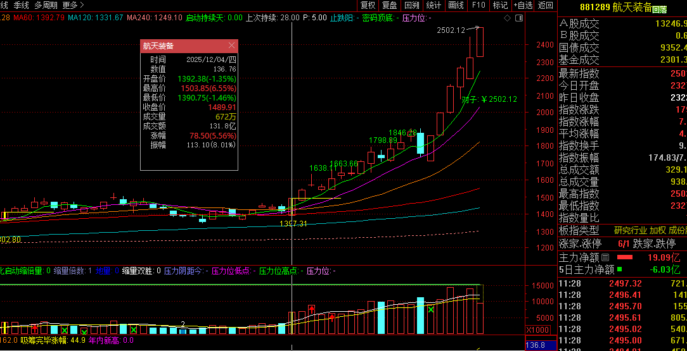


#### 💻 编码考虑

通达信 `MY_QK_BLY`（自定义主图指标）中的【所属板块】源码：

```pascal
{所属板块}
板块开:=IF(板块开关==0, 0, IF(板块开关==1, 1, ISLASTBAR));
DRAWTEXT_FIX(板块开,0,0,0, STRCAT('概念：', GNBLOCK)), COLOR0080FF;
HYZF0:=(HY_INDEXC-REF(HY_INDEXC,1))/REF(HY_INDEXC,1)*100;       A0:=STRSPACE(VAR2STR(HYZF0,2));
HYZF1:=(REF(HY_INDEXC,1)-REF(HY_INDEXC,2))/REF(HY_INDEXC,2)*100;A1:=STRSPACE(VAR2STR(HYZF1,2));
HYZF2:=(REF(HY_INDEXC,2)-REF(HY_INDEXC,3))/REF(HY_INDEXC,3)*100;A2:=STRSPACE(VAR2STR(HYZF2,2));
HYZF3:=(REF(HY_INDEXC,3)-REF(HY_INDEXC,4))/REF(HY_INDEXC,4)*100;A3:=STRSPACE(VAR2STR(HYZF3,2));
HYZF4:=(REF(HY_INDEXC,4)-REF(HY_INDEXC,5))/REF(HY_INDEXC,5)*100;A4:=STRSPACE(VAR2STR(HYZF4,2));
A43:=VARCAT(A4,A3);
A21:=VARCAT(A2,A1);
A4321:=VARCAT(A43,A21);
A43210:=VARCAT(A4321,A0);
DRAWTEXT_FIX(板块开,0,0.05,0,VARCAT('行业：', VARCAT(STRSPACE(HYZSCODE), VARCAT(STRSPACE(HYBLOCK), A43210)))) COLOR0000FF;{所属行业及近五日涨幅}
DRAWTEXT_FIX(板块开,0,0.1,0,VARCAT('风格：',FGBLOCK));
DRAWTEXT_FIX(板块开,0,0.15,0,VARCAT('地区：', DYBLOCK));
DRAWTEXT_FIX(板块开,0,0.2,0,VARCAT('选股：',ZDBLOCK));
```

- 概念：`GNBLOCK`
- 风格：`FGBLOCK`

所谓的板块，就是【概念】

在通达信中，就是【条件选股】中的【改变范围】点进去的【概念板块】【风格板块】，如图：

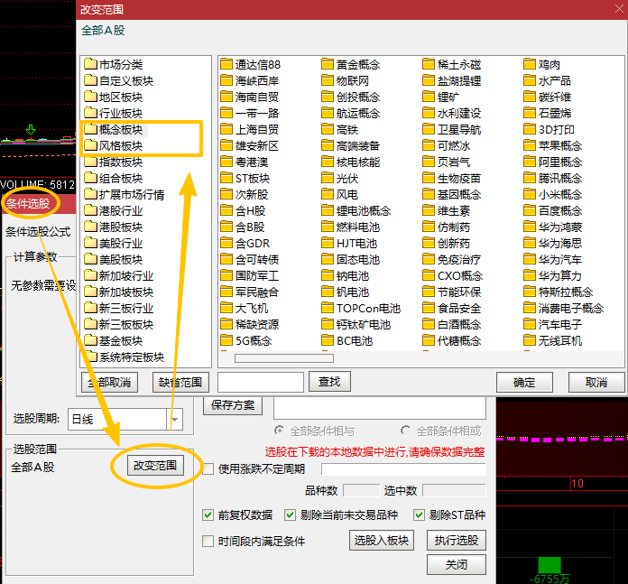


##### `moodtx\docs\api\reader.md`

> ## 04. 读取板块信息
>
> 文件位置参考： [http://blog.sina.com.cn/s/blog_623d2d280102vt8y.html](http://blog.sina.com.cn/s/blog_623d2d280102vt8y.html)
>
> 样例代码：
>
> ```python
> from mootdx.reader import Reader
> 
> reader = Reader.factory(market='std', tdxdir='c:/new_tdx')
> reader.block(symbol='block_zs', group=False)
> ```
>
> 
>
> ```python
> # 分组格式
> from mootdx.reader import Reader
> reader = Reader.factory(market='std', tdxdir='c:/new_tdx')
> 
> reader.block(symbol='block_zs', group=True)
> ```


##### `mootdx\reader.py`

使用 `class StdReader` 的 `block(self, symbol, group, **kwargs)`


##### `pytdx\reader\block_reader.py`

- `class BlockReader(BaseReader)`：获取全部板块的 df？
- `class CustomerBlockReader(BaseReader)`：获取自定义板块

```python

if __name__ == '__main__':
    df = BlockReader().get_df("/Users/rainx/tmp/block_zs.dat")
    print(df)
    df2 = BlockReader().get_df("/Users/rainx/tmp/block_zs.dat", BlockReader_TYPE_GROUP)
    print(df2)
    df3 = CustomerBlockReader().get_df('C:/Users/fit/Desktop/blocknew')
    print(df3)
    df4 = CustomerBlockReader().get_df('C:/Users/fit/Desktop/blocknew',BlockReader_TYPE_GROUP)
    print(df4)
```

> `pytdx\reader\daily_bar_reader.py` 中有日线数据的读取方式。太妙了！
>
> ==该文件还有 `get_security_type`，正好可以让 difoss_stock_util.security_util 参考！==


#### 从【行业板块】入手

> 🔑**搜索关键字**：`industry`
>
> gpcw：股票财务
>
> 数据来源：股票财务数据

##### QMT：`get_industry_name_of_stock(industryType, stockcode)

> 用法： `get_industry_name_of_stock(industryType, stockcode)`
> 释义： ==判定给定股票代码是否在指定的行业分类中==
> 参数： 
> 	industryType：string，行业类别，有 'CSRC' 和 'SW' 两种
> 	stockcode：string，形式如 'stockcode.market'，如 '600000.SH'
> 返回： string：对应行业名，找不到则返回空 string
> 示例：
>
> ```python
> def handlebar(ContextInfo):
>     print(get_industry_name_of_stock('SW','600000.SH'))
> ```

对应的 API 不在 miniQMT（xtquant库）中。

可见是QMT新增的，查找发现在 QMT 的数据目录下（无论国金、guosen_iquant）有配置文件：`datadir/Industry/IndustryData.txt`

##### :star2: miniQMT（xtdata）获取行业概念数据

> [官网文档](https://dict.thinktrader.net/dictionary/industry.html?id=S7b19l#%E8%8E%B7%E5%8F%96%E8%A1%8C%E4%B8%9A%E6%A6%82%E5%BF%B5%E6%95%B0%E6%8D%AE)

```python
from xtquant import xtdata
xtdata.download_sector_data() # 第一次下载会比较耗时
```


##### pytdx：`TdxHq_API.get_finance_info(self, market, code)`

从代码上可见，这数据是需要通过 RPC 访问 tdx 服务器的，属于实时数据。

> :book: 官网文档：https://rainx.gitbooks.io/pytdx/content/installation.html

##### simple-pytdx：`Api.get_finance_info(self, market, code)`

只是返回的 key 是中文，而且居然把 industry 翻译成“工业”（WTF！）

> ✏️ 测试代码：`D:\job_\open_source_\simple-pytdx-main\t01.py`

和 `pytdx` 代码对比，发现两个接口只有 market 的区别（一个是int另一个是枚举，但最终都会以 int 形式进行 unpack）。

不得不说 `simple-pytdx` 库的 `class Market(Enum)` 的定义完美解释了通达信对沪深股市的精简处理：

```python
# api.py
class Api:
    class Market(Enum):
        SZ = 0
        SH = 1
```

这个原则也在自定义板块文件（`.blk`）的内容中得到验证。


##### mootdx：`gpcw(filepath)`

当在 vscode 的中间工程 PYTDX-APIS 中全量查找 `gpcw` 这个邪恶的缩写时，居然发现了：

- `README.md`

  >
  > 通达信财务数据读取
  >
  > ```python
  > from mootdx.affair import Affair
  > 
  > # 远程文件列表
  > files = Affair.files()
  > # 下载单个
  > Affair.fetch(downdir='tmp', filename='gpcw19960630.zip')
  > # 下载全部
  > Affair.parse(downdir='tmp')
  > ```

- `affair.md`：财务数据列表

- `fields.md`：**财务数据字段对照表**（以下注释源于：通达信V7.71 的函数帮助）

  - BKJVALUE

    > 引用板块交易类数据.如果指标支持云数据函数(用于选股除外),则不需要[专业财务数据]下载,该函数只适用于沪深京市场.
    > BKJYVALUE(ID,N,TYPE),ID为数据编号,N表示第几个数据(取1或2),TYPE:为1表示做平滑处理,没有数据的周期返回上一周期的值;为0表示不做平滑处理;2表示没有数据则为0.
    > 板块交易类数据函数，数据编号如下：
    > 几个主要指数(总市值等指数,上证指数,深圳成指,沪深300,创业板指,科创50,北证50)和通达信二、三级行业、通达信研究行业板块指数指标
    > 如果是880001总市值，相当于是整个A股市场的数据
    > 5--市盈率TTM   整体法  算术平均
    > 6--市净率MRQ   整体法  算术平均
    > 7--市销率TTM   整体法  算术平均
    > 8--市现率TTM   整体法  算术平均
    > 9--涨跌数   上涨家数  下跌家数
    > 10--板块总市值(亿元)   整体法  算术平均
    > 11--板块流通市值(亿元) 整体法  算术平均
    > 12--涨停数   涨停家数  曾涨停家数[注：该指标展示20160926日之后的数据]
    > 13--跌停数   跌停家数  曾跌停家数[注：该指标展示20160926日之后的数据]
    > 14--涨停数据  市场高度(不含ST股和未开板新股)  2板及以上涨停个数(不含ST股和未开板新股)[注：该指标展示20180319日之后的数据]
    > 15--融资融券  沪深京融资余额(万元)   沪深京融券余额(万元)
    > 16--陆股通资金流入  沪股通流入金额(亿元)  深股通流入金额(亿元) [注：该指标展示20170320日之后的数据]
    > 17--开盘成交数    开盘成交额(万元)  开盘成交量(万股)
    > 18--板块股息率(%)   算数平均  整体法
    > 19--板块自由流通市值(亿元)  整体法  算术平均

  - BKJYONE

    > 引用某天某种类型的板块交易类数据.如果指标支持云数据函数(用于选股除外),则不需要[专业财务数据]下载,该函数只适用于沪深京市场.
    > BKJYONE(ID,N,Y,MMDD),ID为数据编号,N表示第几个数据(取1或2),Y和MMDD表示年和月日.
    > 如果Y为0,MMDD为0,表示最新数据,MMDD为1,2,3...,表示倒数第2,3,4...个数据
    > 板块交易类数据函数，数据编号如下：
    > 几个主要指数(总市值等指数,上证指数,深圳成指,沪深300,创业板指,科创50,北证50)和通达信二、三级行业、通达信研究行业板块指数指标
    > 如果是880001总市值，相当于是整个A股市场的数据
    > 5--市盈率TTM   整体法  算术平均
    > 6--市净率MRQ   整体法  算术平均
    > 7--市销率TTM   整体法  算术平均
    > 8--市现率TTM   整体法  算术平均
    > 9--涨跌数   上涨家数  下跌家数
    > 10--板块总市值(亿元)   整体法  算术平均
    > 11--板块流通市值(亿元) 整体法  算术平均
    > 12--涨停数   涨停家数  曾涨停家数[注：该指标展示20160926日之后的数据]
    > 13--跌停数   跌停家数  曾跌停家数[注：该指标展示20160926日之后的数据]
    > 14--涨停数据  市场高度(不含ST股和未开板新股)  2板及以上涨停个数(不含ST股和未开板新股)[注：该指标展示20180319日之后的数据]
    > 15--融资融券  沪深京融资余额(万元)   沪深京融券余额(万元)
    > 16--陆股通资金流入  沪股通流入金额(亿元)  深股通流入金额(亿元) [注：该指标展示20170320日之后的数据]
    > 17--开盘成交数    开盘成交额(万元)  开盘成交量(万股)
    > 18--板块股息率(%)   算数平均  整体法
    > 19--板块自由流通市值(亿元)  整体法  算术平均

  - SCJYALUE

    > 引用市场总的交易类数据.如果指标支持云数据函数(用于选股除外),则不需要[专业财务数据]下载,该函数只适用于沪深京市场.
    > SCJYVALUE(ID,N,TYPE),ID为数据编号,N表示第几个数据(取1或2),TYPE:为1表示做平滑处理,没有数据的周期返回上一周期的值;为0表示不做平滑处理;2表示没有数据则为0.
    > 市场交易类数据函数，数据编号如下：
    > 1--融资融券       沪深京融资余额(万元) 沪深京融券余额(万元)
    > 2--陆股通资金流入 沪股通流入金额(亿元) 深股通流入金额(亿元)[注：沪股通限制展示2000条数据，深股通展示自20161205以后的数据]
    > 3--沪深京涨停股个数 涨停股个数  曾涨停股个数 [注：该指标展示20160926日之后的数据]
    > 4--沪深京跌停股个数 跌停股个数  曾跌停股个数 [注：该指标展示20160926日之后的数据]
    > 5--上证50股指期货  净持仓(手)[注：该指标展示20171009日之后的数据]
    > 6--沪深300股指期货 净持仓(手) [注：该指标展示20171009日之后的数据]
    > 7--中证500股指期货 净持仓(手) [注：该指标展示20171009日之后的数据]
    > 8--ETF基金规模份额数据 ETF基金规模(亿份) ETF净申赎(亿份)
    > 9--沪月新开A股账户   沪月新开A股账户(万户) 
    > 10--增减持统计    增持额(万元)  减持额(万元)[注：部分公司公告滞后,造成每天查看的数据可能会不一样] 
    > 11--大宗交易      溢价的大宗交易额(万元) 折价的大宗交易额(万元)
    > 12--限售解禁      限售解禁计划额(亿元)  限售解禁股份实际上市金额(亿元)[注：该指标展示201802月之后的数据;部分股票的解禁日期延后，造成不同日期提取的某天的计划额可能不同]
    > 13--分红    市场总分红额(亿元)[注：除权派息日的A股市场总分红额] 
    > 14--募资    市场总募资额(亿元)[注：发行日期/除权日期的首发、配股和增发的总募资额] 
    > 15--打板资金    封板成功资金(亿元) 封板失败资金(亿元) [注：该指标展示20160926日之后的数据]
    > 16--龙虎榜    买入总金额(亿元) 卖出总金额(亿元)
    > 17--龙虎榜机构数据    买入金额(亿元) 卖出金额(亿元) 
    > 18--龙虎榜营业部数据    买入金额(亿元) 卖出金额(亿元) 
    > 19--龙虎榜沪深股通数据    买入金额(亿元) 卖出金额(亿元)
    > 20--陆股通净买入    沪股通净买入额(亿元) 深股通净买入额(亿元)
    > 21--每周无限售质押率    深市质押率(%) 沪市质押率(%)[注：该指标展示20180128日之后的数据]
    > 22--每周有限售质押率    深市质押率(%) 沪市质押率(%)[注：该指标展示20180128日之后的数据]
    > 23--连板家数    连板股个数(包含ST和未开板新股)  连板股个数(不含ST股和未开板新股）[注：该指标展示20180319日之后的数据]
    > 24--沪深京涨跌停股个数    涨停股个数(不含ST股和未开板新股) 跌停股个数（不含ST股）[注：该指标展示20160926日之后的数据]
    > 25--融资融券    沪深京融资买入额（万元）沪深京融券卖出量（万股）
    > 26--每周市场质押比     每周市场质押比例（%）[注：该指标展示20180316日之后的数据]
    > 27--央行公开市场净投放    央行公开市场净投放 (亿元) 
    > 28--历史A股新高新低数  历史新高A股股票个数 历史新低A股股票个数(上市满一年的股票)
    > 29--120天A股新高新低数 120天新高A股股票个数 120天新低A股股票个数(上市满一年的股票)
    > 30--涨停数据  市场高度(不含ST股和未开板新股)  2板以上涨停个数(不含ST股和未开板新股)[注：该指标展示20180319日之后的数据]
    > 31--涨跌家数   涨家数（剔除停牌）  跌家数（剔除停牌）
    > 32--20天A股新高新低数 20天新高A股股票个数 20天新低A股股票个数(上市满一年的股票)
    > 33--市场总封单金额  涨停封单金额（亿元）跌停封单金额（亿元）[注：该指标展示20160926日之后的数据]
    > 34--涨跌股成交量    上涨股成交量(万手)  下跌股成交量(万手) 
    > 35--涨停数据   换手板家数  回封率(%)  [注：两个指标都剔除了未开板新股，换手板家数展示20190605日之后的数据，回封率展示20180927日之后的数据]
    > 36--曾涨跌停股个数	曾涨停股个数(剔除ST股和未开板新股)	曾跌停股个数(剔除ST股) [注：该指标展示20160926日之后的数据]
    > 37--转融券  融出市值(亿元)  期末余额(亿元)
    > 38--ETF基金规模金额数据  ETF基金规模(亿元)  ETF净申赎(亿元)
    > 39--涨跌5%家数  涨幅大于等于5%家数  跌幅大于等于5%家数
    > 40--陆股通成交  陆股通成交总额(亿元) 陆股通成交总笔(万笔)
    > 41--中证1000股指期货 净持仓(手) [注：该指标展示20220722日之后的数据]
    > 42--沪深股通成交金额  沪股通成交总额(亿元)  深股通成交总额(亿元)

  - SCJYONE

    > 引用某天某种类型的市场总的交易类数据.如果指标支持云数据函数(用于选股除外),则不需要[专业财务数据]下载,该函数只适用于沪深京市场.
    > SCJYONE(ID,N,Y,MMDD),ID为数据编号,N表示第几个数据(取1或2),Y和MMDD表示年和月日.
    > 如果Y为0,MMDD为0,表示最新数据,MMDD为1,2,3...,表示倒数第2,3,4...个数据
    > 市场交易类数据函数，数据编号如下：
    > 1--融资融券       沪深京融资余额(万元) 沪深京融券余额(万元)
    > 2--陆股通资金流入 沪股通流入金额(亿元) 深股通流入金额(亿元)[注：沪股通限制展示2000条数据，深股通展示自20161205以后的数据]
    > 3--沪深京涨停股个数 涨停股个数  曾涨停股个数 [注：该指标展示20160926日之后的数据]
    > 4--沪深京跌停股个数 跌停股个数  曾跌停股个数 [注：该指标展示20160926日之后的数据]
    > 5--上证50股指期货  净持仓(手)[注：该指标展示20171009日之后的数据]
    > 6--沪深300股指期货 净持仓(手) [注：该指标展示20171009日之后的数据]
    > 7--中证500股指期货 净持仓(手) [注：该指标展示20171009日之后的数据]
    > 8--ETF基金规模份额数据 ETF基金规模(亿份) ETF净申赎(亿份)
    > 9--沪月新开A股账户   沪月新开A股账户(万户) 
    > 10--增减持统计    增持额(万元)  减持额(万元)[注：部分公司公告滞后,造成每天查看的数据可能会不一样] 
    > 11--大宗交易      溢价的大宗交易额(万元) 折价的大宗交易额(万元)
    > 12--限售解禁      限售解禁计划额(亿元)  限售解禁股份实际上市金额(亿元)[注：该指标展示201802月之后的数据;部分股票的解禁日期延后，造成不同日期提取的某天的计划额可能不同]
    > 13--分红    市场总分红额(亿元)[注：除权派息日的A股市场总分红额] 
    > 14--募资    市场总募资额(亿元)[注：发行日期/除权日期的首发、配股和增发的总募资额] 
    > 15--打板资金    封板成功资金(亿元) 封板失败资金(亿元) [注：该指标展示20160926日之后的数据]
    > 16--龙虎榜    买入总金额(亿元) 卖出总金额(亿元)
    > 17--龙虎榜机构数据    买入金额(亿元) 卖出金额(亿元) 
    > 18--龙虎榜营业部数据    买入金额(亿元) 卖出金额(亿元) 
    > 19--龙虎榜沪深股通数据    买入金额(亿元) 卖出金额(亿元)
    > 20--陆股通净买入    沪股通净买入额(亿元) 深股通净买入额(亿元)
    > 21--每周无限售质押率    深市质押率(%) 沪市质押率(%)[注：该指标展示20180128日之后的数据]
    > 22--每周有限售质押率    深市质押率(%) 沪市质押率(%)[注：该指标展示20180128日之后的数据]
    > 23--连板家数    连板股个数(包含ST和未开板新股)  连板股个数(不含ST股和未开板新股）[注：该指标展示20180319日之后的数据]
    > 24--沪深京涨跌停股个数    涨停股个数(不含ST股和未开板新股) 跌停股个数（不含ST股）[注：该指标展示20160926日之后的数据]
    > 25--融资融券    沪深京融资买入额（万元）沪深京融券卖出量（万股）
    > 26--每周市场质押比     每周市场质押比例（%）[注：该指标展示20180316日之后的数据]
    > 27--央行公开市场净投放    央行公开市场净投放 (亿元) 
    > 28--历史A股新高新低数  历史新高A股股票个数 历史新低A股股票个数(上市满一年的股票)
    > 29--120天A股新高新低数 120天新高A股股票个数 120天新低A股股票个数(上市满一年的股票)
    > 30--涨停数据  市场高度(不含ST股和未开板新股)  2板以上涨停个数(不含ST股和未开板新股)[注：该指标展示20180319日之后的数据]
    > 31--涨跌家数   涨家数（剔除停牌）  跌家数（剔除停牌）
    > 32--20天A股新高新低数 20天新高A股股票个数 20天新低A股股票个数(上市满一年的股票)
    > 33--市场总封单金额  涨停封单金额（亿元）跌停封单金额（亿元）[注：该指标展示20160926日之后的数据]
    > 34--涨跌股成交量    上涨股成交量(万手)  下跌股成交量(万手) 
    > 35--涨停数据   换手板家数  回封率(%)  [注：两个指标都剔除了未开板新股，换手板家数展示20190605日之后的数据，回封率展示20180927日之后的数据]
    > 36--曾涨跌停股个数	曾涨停股个数(剔除ST股和未开板新股)	曾跌停股个数(剔除ST股) [注：该指标展示20160926日之后的数据]
    > 37--转融券  融出市值(亿元)  期末余额(亿元)
    > 38--ETF基金规模金额数据  ETF基金规模(亿元)  ETF净申赎(亿元)
    > 39--涨跌5%家数  涨幅大于等于5%家数  跌幅大于等于5%家数
    > 40--陆股通成交  陆股通成交总额(亿元) 陆股通成交总笔(万笔)
    > 41--中证1000股指期货 净持仓(手) [注：该指标展示20220722日之后的数据]
    > 42--沪深股通成交金额  沪股通成交总额(亿元)  深股通成交总额(亿元)

##### mootdx：affair 子命令

安装完 mootdx 库后，会在 Python/Script 目录下生成一个名为 `mootdx.exe` 的工具。具体命令可以参考 `README.md`。

其中的 `mootdx affair` 子命令都是针对“财务数据”进行操作的。其源码位于 `mootdx\__main__.py` 文件。


##### tdxpy

> 对比类似的库 `pytdx`，`tdxpy` 库只保留了 `reader`,`parser`,`crawler` 和子目录的 `heartbeat.py`,` hq.py`, `exhq.py` 等基础功能。
>
> 况且能被 mootdx 使用，应该是比 `pytdx` 是更新的。

看到各种解析通达信文件的源码都来源于 tdxpy，发现自己居然没用过 `struct.Struct` 这个库（只知道他是序列/反序列化的库），AI一下廓然开朗：

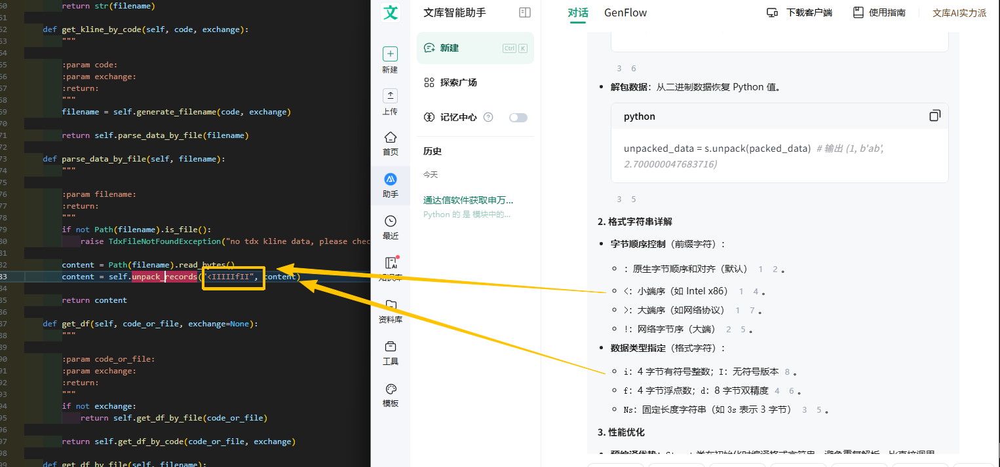

##### 通达信/官网/专业财务数据/下载

https://www.tdx.com.cn/article/stockfin.html

##### 🌟【结论】==行业板块== 在 tdxhy.cfg 文件中

|      | 目录/文件                | 作用                                                         | 格式                                                         | 例子                                                |
| ---- | ------------------------ | ------------------------------------------------------------ | ------------------------------------------------------------ | --------------------------------------------------- |
|      | 📁new_tdx\T0002\hq_cache  | 行情缓存目录                                                 |                                                              |                                                     |
| ✔️    | 📗 tdxhy.cfg              | 通达信==【行业板块】==配置                                   | `市场类型<int>｜个股short_code｜指数序号（T开头）｜｜｜ 板块序号blockid（X开头）` | 查找组后一列为 `X3103` 的都是属于【航天装备】的个股 |
|      | 📗 tdxzs.cfg              | 通达信==【指数板块】==配置                                   |                                                              | （⚠️无 `X3103`内容）                                 |
| ✔️    | 📗 tdxzs3.cfg             | 🌟比 `tdxzs.cfg` 多了【研究行业】列                           | `caption｜行业板块short_code｜？｜？｜？｜指数序号（T）或板块序号（X）或 板块名（字符串）` | `航天装备｜881289｜12｜1｜1｜X3103`                 |
|      | 🔠 行业板块short_code     | 该字段可直接访问k线数据                                      |                                                              |                                                     |
|      | 📗 tdxstat2.cfg           | 个股最后一交易日数据缓存                                     | （⚠️暂时不清楚数据如何对齐）                                  |                                                     |
|      | 📗 tdxzsbase.cfg          |                                                              |                                                              |                                                     |
|      | 📗 tdxzsbase2.cfg         |                                                              |                                                              |                                                     |
| ✔️    | 📗 infoharbor_block.dat   | 【概念/风格/指数 板块】有效时间和所含个股                    | 有两种列：<br />1、`#`开头的，是“板块列”，格式：`#{block_type}_{block_name},{index},{block_instrument_id},{start_date},{end_date}`<br />2、以 `0#` 或 `1#` 或 `2#` 开头组成的股票列表，说明这些个股在这个上一行的板块中。（0：深市；1：沪市；2：北证） |                                                     |
|      | 📁new_tdx\T0002\cloud_cfg | 云配置目录                                                   |                                                              |                                                     |
| ✔️    | 📗 hy_tree.xml            | ==【行业板块】（3级）==配置树                                | xml格式，由 `<node caption, visable, blockid>` 构成          |                                                     |
|      | 🔠  `<caption>`           |                                                              | 标题                                                         | 航天装备                                            |
|      | 🔠  `<blockid>`           |                                                              | `blockid`规则：`X{一级行业两位序号}[二级行业两位序号][三级行业两位序号]` | X3103                                               |
|      | 📗 hy_fxszs.xml           | 【行业】分析师指数配置表                                     |                                                              |                                                     |
|      | 📗func_scrd101.cfg        | 关注度、专业关注度、共鸣度、舆情热度、眼光数据（月）【看多/看空/多空比】 | 关注度为当日盘中和盘后点击次数；共鸣度为当日盘中和盘后浏览次数；专业关注度为level2用户的当日盘中和盘后点击次数。 |                                                     |

##### 通达信：==板块== 研究

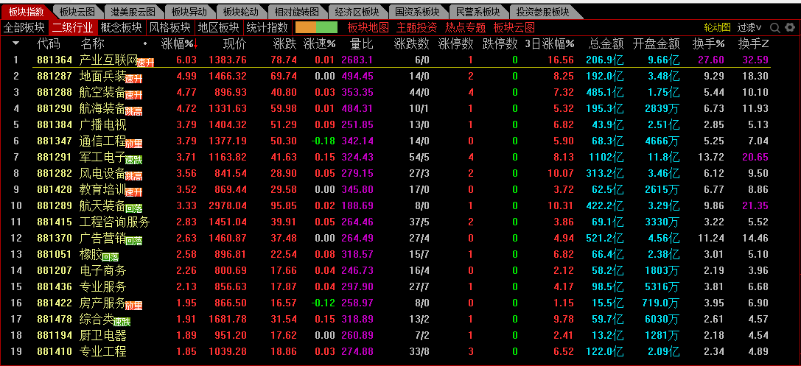

截至 2026-1-8，通达信的【板块】（全部板块）共：540 个

- 二级行业：109 个
- 概念板块：251 个
- 风格板块：139 个
- 地区板块：14 个
- 统计指数：44 个


##### 通达信：文件目录解密

| 目录/文件               | 作用            | 如何解析                  |
| ----------------------- | --------------- | ------------------------- |
| new_tdx\T0002\blocknew\ | 自定义板块 目录 | mootdx\tools\customize.py |
| - LastSync\             | 上次同步的备份  |                           |
| - blocknew.cfg          |                 |                           |


### 【问财】:traffic_light: 接口搜索文献

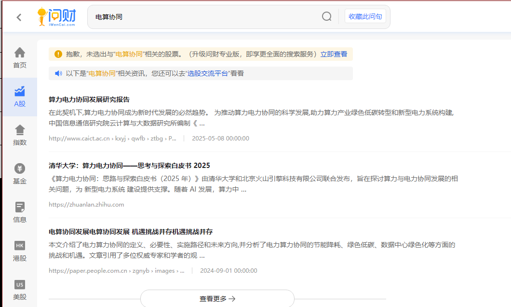

上述检索出来几篇文件：

- [算力电力协同发展研究报告](https://www.caict.ac.cn/kxyj/qwfb/ztbg/202505/P020250509511369626787.pdf)
- [清华大学：算力电力协同——思考与探索白皮书 2025](https://zhuanlan.zhihu.com/p/25742520654)
- [电算协同发展电算协同发展 机遇挑战并存机遇挑战并存](https://paper.people.com.cn/zgnyb/images/2024-09/02/03/zgnyb2024090203.pdf)

学习产业逻辑，有助帮助找到最佳投资逻辑。


## 方向：筑底

真吸最大量（吸筹完毕前一天）的最低价，在数天后破位，且没有出现第二次真吸，是否代表新的底还没出现？随后几天下跌的几率是多少？个案分析：2025-11-14 的 山河智能（002097）

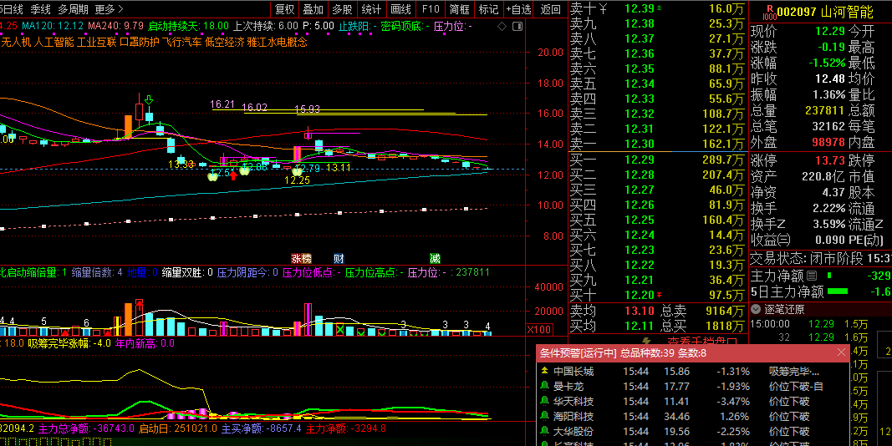


## 方向：根据【财联社.电报】和 个股拉升响应时间，倒推全网新闻最早的媒体

例如：2026年1月5日 的财联社电报：

<b style='color:red'>14:52:29</b> **【四川：开展全国一体化算力网算力设施安全试点】**

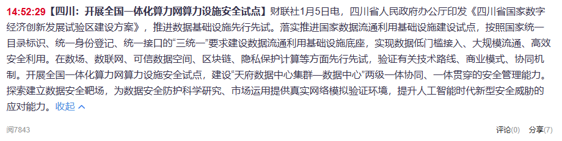

<b style='color:red'>14:51:36</b>**【四川：探索开展数字经济促进条例、人工智能产业促进条例等地方性立法】**

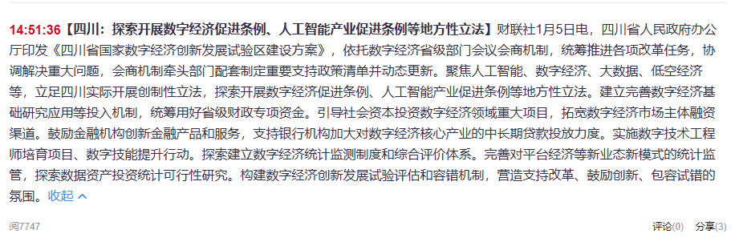

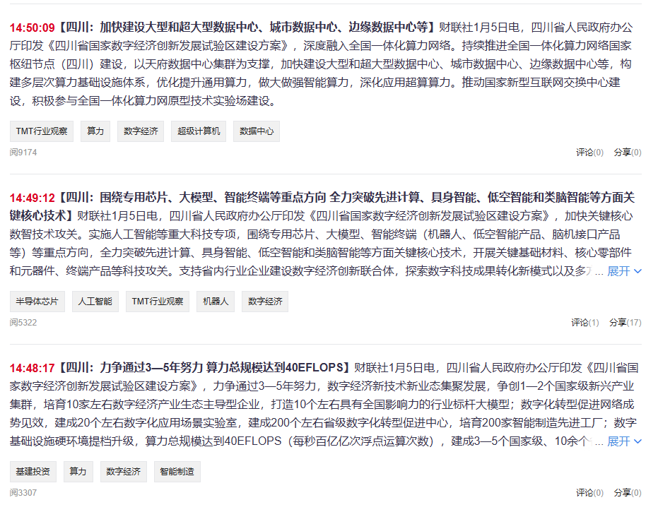

最早的信息是：

<b style='color:red'>14:48:17</b> **【四川：力争通过3—5年努力 算力总规模达到40EFLOPS】**

【600839 四川长虹】的分时拉升起点是：==**14:48**==

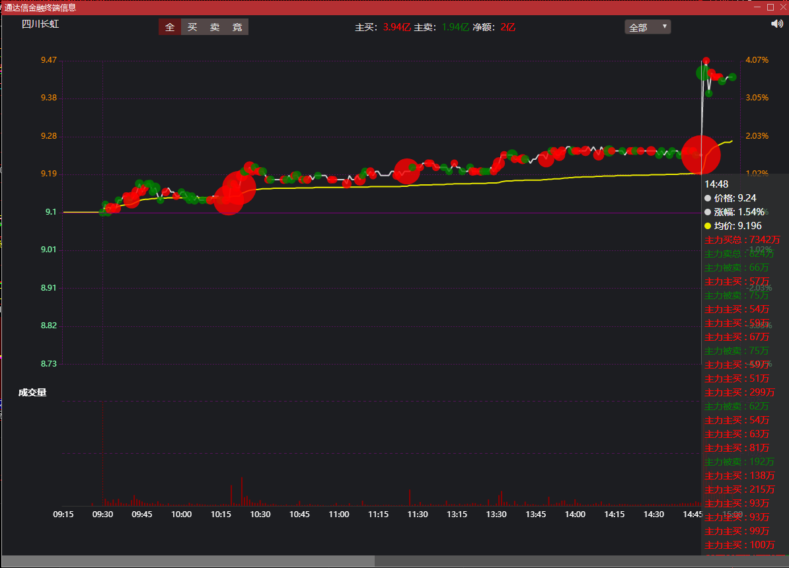

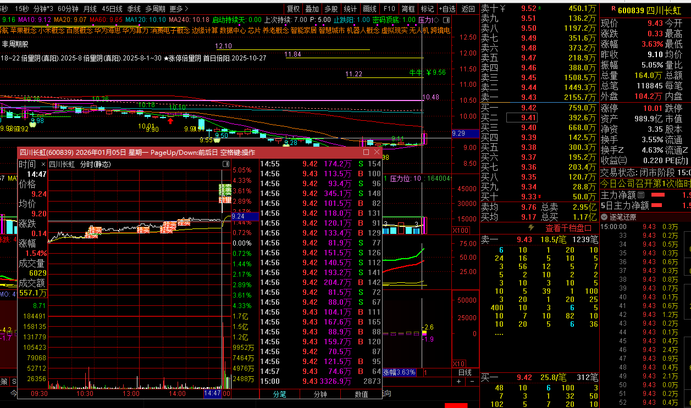 


## 🌟 接下来考虑：

1. 是否把指标表（量化的因子表）统一在一起？
   - [ ] 结论：基础数据（instrument_detail），slb_detail 每天更新（增量对比更新以保留历史痕迹）
   - [ ] 实时数据：maket_data 按周期备份 `1d` …… 等表。
   - [ ] 因子表——`factor`
     - [ ] 对于字段的添加/删除、原来的程序需要如何适配？`MySecurityBaseModel` 基类是否可自动适配？
     - [ ] 指标脚本的命名与动态添加机制？
   
2. 盘中策略本质上是某一个指标（由多个基础指标〔如：量，价，内外盘量等〕构成）如何随着其对应的基础指标的实时变化（由level2数据源更新）而变化，进而达到某个临界值域触发提醒。

   - [ ] xtdata 是否支持 Level2 行情

   - [ ] ==决定：把 L2 数据落盘==
     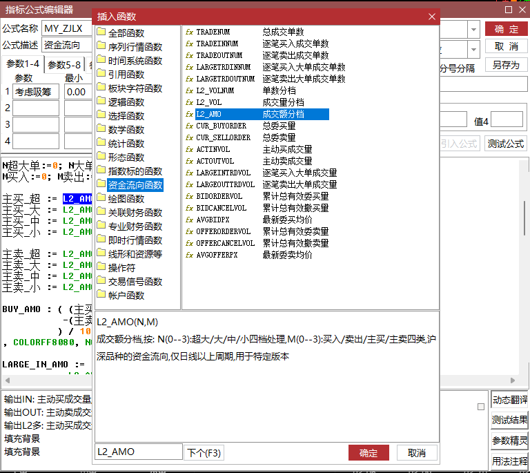

     参考：[[【通达信L2黑科技】 用 DLL 把 10 年机构大单净额 1 秒拖进本地，选股、排序、回测快到飞起！](https://www.cnblogs.com/HJH1222/p/19141806)](https://www.cnblogs.com/HJH1222/p/19141806)

     

3. :question: 如何支持 类似同花顺『问财』选股的那种多少天平均持股收益回测统计的框架。

4. Ai相关：如何搭建大模型来自动辅助分析量价关系，让大模型能调用自定义接口（包括QMT或者本地服务接口的能力），dify可以不？

5. :star: 【市场情绪模块】通达信（market.dat）和 同花顺 个股和概念对应表数据在哪里得到？（接口可带ts？有否增量推送？）
   - [x] 通过分析 `T0002/cloud_cfg/hy_tree.xml` 和 `T0002/hq_cache/tdxhy.cfg`
   - [x] tdx_quant 的 API：`get_sector_list` 和 `get_stock_list_in_sector`

6. 技术层面：
   
   1. 日线


## 自研APP：荐股

本APP用于在特定渠道获取或发掘新机会时，用于记录和发布（免去微信中群发、记录的麻烦）。

参考 涨停诀v3.4.6 的【题材流】页面，因其具有三级联动的页面：

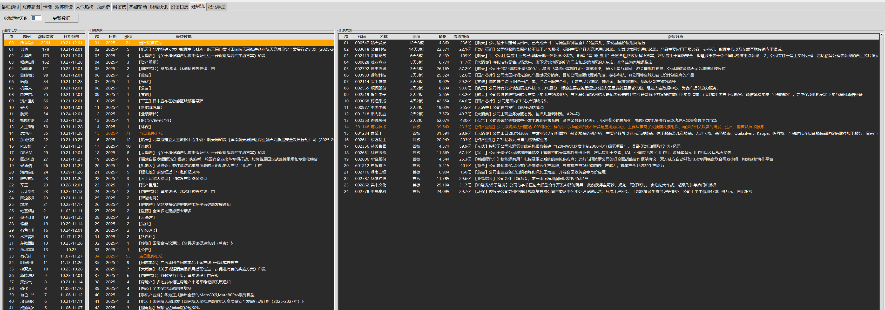

三级分别从原来的【题材汇总】【日期数据】【股票数据】改成：

- 战法/来源：
  - **列**：序、战法/来源、日期范围
  - 战法/来源
    - 涨停倍量阴 / 首日倍阳 / 倍阳回踩（低吸）/ 吸筹完毕 ……（各种自定义战法）
    - 大决策 / 汇正 / 国投GRT.行稳致远 / 国投GRT.增长待涨 / 九方 ……（各种推荐人/来源）
- 日期数据：
  - **列**：序、日期、周
- 股票数据
  - **列**：序、代码、名称、价格、买入理由、推荐时间、买入价格、盈亏%、止损位、目标价格、建仓比例、状态
    - 状态：关注 / 取关

以上所有 **列** 够成 服务端数据库表的列。

# :bug: 缺陷（BUG）与存在问题（TODO）

## 1、市场股票统计偏差

xtdata 库和  `simple-pytdx` 库，在统计上海（SH）市场时偏差2个股票，详细日志：

使用 `xtdata`库统计的执行结果：

```python
Administrator@difoss-house MINGW64 /z/stock_/quantitative_trading_/国金.QMT/miniqmt教程/miniQMT.code
$ python t_xtquant.py -a

[PARAMETER] all=True, limit=-1, count=30, db_type=pg
数据库初始化完成: postgresql+psycopg2://postgres:***
trading_info=<TradingInfo(start_time=20251120, end_time=20251231, count=30)>
处理市场: SH
市场 SH 的有 2340 只股票
处理市场: SZ
市场 SZ 的有 2921 只股票
处理市场: BJ
市场 BJ 的有 288 只股票
```

沪深两市股票总数：5186 只。

使用 `simple-pytdx` 库统计的执行结果：

```python
$ ./t_simple_pytdx.py -m ALL

[PARAMETER] count=10, limit=10, markets=['ALL']
[PARAMETER] 预处理后的参数： count=10, limit=10, markets=['SH', 'SZ'], security_types=[<SecurityType.STOCK: 'stock'>], st=stock
[RESULT] market=SH, get_stocks_count=26412
[RESULT] market=SZ, get_stocks_count=22481
市场: SH
{'股票': 2307}
市场: SZ
{'股票': 2883}
获取到 5190 条股票信息:         股票代码  volunit   股票名称  decimal_point      昨日收盘价  类型  市场
0     600000      100   浦发银行              2  10.060000  股票  SH
1     600004      100   白云机场              2   9.480000  股票  SH
2     600006      100   东风股份              2   6.820000  股票  SH
3     600007      100   中国国贸              2  20.139999  股票  SH
4     600008      100   首创环保              2   3.040000  股票  SH
...      ...      ...    ...            ...        ...  ..  ..
5185  301667      100  纳百川              2  70.050003  股票  SZ
5186  301668      100   昊创瑞通              2  52.070000  股票  SZ
5187  301678      100  新恒汇              2  73.000000  股票  SZ
5188  301687      100  新广益              2  57.119999  股票  SZ
5189  302132      100   中航成飞              2  76.029999  股票  SZ

[5190 rows x 7 columns]
```

使用 tdx_quant 库进行统计，结果（和 simple-pytdx）一致：

```python
 $ ./tdxdata_repl.py
 tdx> get-stock-list -m 50
市场【代码：50 名称：沪深A股】: ['000001.SZ', '000002.SZ', '000004.SZ', '000006.SZ', '000007.SZ',
'000008.SZ', '000009.SZ', '000010.SZ', '000011.SZ', '000012.SZ', '000014.SZ', '000016.SZ',
'000017.SZ', '000019.SZ', '000020.SZ', '000021.SZ', '000025.SZ', '000026.SZ', '000027.SZ',
... ...
 '688789.SH', '688790.SH', '688793.SH', '688795.SH', '688796.SH', '688798.SH', '688799.SH',
'688800.SH', '688802.SH', '688805.SH', '688807.SH', '688809.SH', '688819.SH', '688981.SH',
'689009.SH', '603284.SH', '688712.SH', '688816.SH', '688818.SH']
共 5190 只个股
```

==结论：xtquant 数量少4只，还是用 tdx 的比较稳。==

## 2、板块统计差异

==TODO==

## 3、下单接口

### ~~pytdx（关键dll无法被封，无法下单）~~

pytdx 的下单接口在 `pytdx/trade/trade.py` 中的 `TdxTradeApi` 类中封装，测试代码是 `bin/get_tdx_trader_server.py` 中。

其中需要的 `Trade.dll` 文件已经无法下载。

> 架构上，先在本地跑起 `TdxTradeServer`（`http://127.0.0.1:10092/api`），然后 `Trade` 模块调用 API。

### QMT

OK！但手续费贵。

#### 利用 AutoClaw 提示，让AI生成基于通达信预警文件的 QMT API 下单

> from: 涨停诀指标交流群——雁孤村

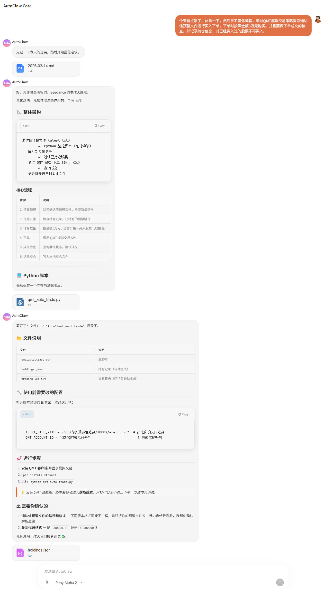


### TdxQuant

下单接口（暂时预留，但未开通）完全和 QMT 的一致：`order_stock()`

# 新技术

## `pydantic`

带有数据校验的类型库，而且能和 FastAPI 直接对接

参考：

- [如何利用Pydantic做类型强制检查? - 匡醍量化的回答 - 知乎](https://www.zhihu.com/question/598806732/answer/1987457319357945063)

## 挖因子


## `TdxQuant`

> ## 更新版本记录 ==【[原文](https://sns.tdx.com.cn/site/tdx_sns/page_index.html#/detail?resId=6c4c201e08844129b1c0f3f124623ad7&resType=14&uid=RL160331210204479321WHW)】==
>
> ### 2026-3-27
>
> https://data.tdx.com.cn/test/new_tdx_test20260327.exe
>
> 2026-3-27主要升级:
> 一.TQ策略更
> 1.新增获取股票所属板块get_relation
> 2.新增调用客户端功能接口exec_to_tdx
> 3.新增撤单cancel_order_stock
> 4.新增账户资产查询query_stock_asset
> 5.交易类账户函数逻辑更新
> 6.order_stock对于模拟账户自动下单
> 7.order_stock新增信用交易：担保品买入、担保品卖出，融资买入，融券卖出
> 8.期货期权类型支持，新增常量枚举
> 9.其他函数支持和细节修正
> 二.其他部分修改：
> 1.修正短线宝优选的问题
> 2.完善综合版T型报价
> 3.部分系统公式中的CAPITAL函数换成FINANCE(7)
> 4.系统设置->参数 增加北交所市价的选择
> 5.其它诸多UI和BUG的修改
>
> ### 2026-3-6
>
> - https://data.tdx.com.cn/test/new_tdx_test20260306.exe
>
> - 更新日志
>
>   一、TQ策略更新：
>
>   1. 获取跟踪指数的ETF信息get_trackzs_etf_info
>   2. refresh_cache新增参数 'ZS' 表示沪深京指数
>   3. get_stock_list新增参数91,跟踪指数的ETF信息
>   4. TQ数据刷新在竞价期间的问题
>   5. 其他函数细节修正
>   
>   二、其他部分修改：
>   
>   1. 修正港股美股本地前复权存在未来除权除息的影响的问题
>   
>   2. 修正尾盘竞价少了数据显示的问题
>   3. 部分版本如果是提示重新启动的话,重新启动后直接登录进入主界面
>   4. 部分券商资金帐号超长时的处理
>   5. 加入新版T型报价的支持
>   6. 其它诸多UI和BUG的修改
>
> ### 2026-2-27
>
> - https://data.tdx.com.cn/test/new_tdx_test20260227.exe
>
> - 更新日志
>
>   一、TQ策略更新：
>
>   1. get_more_info等支持更多行情数据项
>   2. tqcenter几处细节修改
>
>   二、其他部分修改：
>
>   1. 核按钮键设置支持HOME END INSERT键模式
>   2. 支持将当日成交的标识显示在当天的日线和分钟线中
>   3. 行情界面显示效率的优化
>   4. 修正CDR菜单的BUG
>   5. 支持港股通与港股的画线互通
>   6. 如果单元太小或隐藏在标签后,则不响应刷新动作
>   7. 专业财务数据下载时,加大查找信息的超时时间
>   8. 选择范围中支持港股通类型的特别处理
>   9. 恒生指数扩展区加入港股盘面
>   10. 修正股东权益比等函数的BUG
>   11. 其它诸多UI和BUG的修改
>
> ### 2026-2-12
>
> - https://data.tdx.com.cn/test/new_tdx_test20260212.exe
>
> - 更新日志
>
>   一、TQ策略更新：
>
>   1. 批量调用公式内部优化提速
>   2. send_user_block可以添加股票进自选股，自选股简称为ZXG
>   3. 新增港股指数（.HI）
>   4. 解决多个客户端同时运行时的TQ冲突的问题
>
>   二、其他部分修改：
>
>   1. 解决部分机器上不能重新登录的问题
>   2. 提高龙虎看盘和资金流向的数据更新及时性
>   3. 修正香港暗盘行情半日市时间轴的问题
>   4. 跌停盘口也支持显示跌停原因
>   5. 其它诸多UI和BUG的修改
>
> ###  通达信金融终端V7.76内测版（2026-01-30）
>
> - https://data.tdx.com.cn/test/new_tdx_test20260130.exe
>
> - 更新日志
>
>   一、TQ策略更新：
>
>   1. 支持调用通达信公式进行计算
>   2. 新增函数：get_more_info,get_gb_info等
>   3. 新增期货中证宏观等市场数据
>   4. 其他细节问题修复
>
>   二、NewTC交易的修改：
>
>   1. 快枪手支持+-调整价格,新增单独涨跌停价格,高度可调整
>   2. 闪电买卖北交所的BUG修正,闪电下单锁定涨停价失效的问题修正
>   3. 闪电买卖支持融资融券多种模式切换
>
>   三、其他部分修改：
>
>   1. 选择面板支持细分行业菜单
>   2. 修正主图附加很多其他指标时一处崩溃问题
>   3. 修正超级盘口一处数据显示的BUG
>   4. 新增贵金属主题基金类型
>   5. 预警线支持设置加粗
>   6. 期货几种到期类型判断节假日的问题
>   7. 扩展区覆盖整个分时图区域时的处理
>   8. 动态板块页面效果优化
>   9. 外部调用客户端时的容错处理
>   10. 其它诸多UI和BUG的修改
>
> ### 通达信金融终端V7.75内测版（2025-12-20）
>
> - https://data.tdx.com.cn/test/new_tdx_test20251220.exe
> - 更新日志
>   1. 进一步完善TQ策略和TQ数据接口
>   2. 加入TQ策略输出数据的相关函数和公式
>   3. 修正自选股同步的一处问题
>   4. 脱机下的分钟线也按本地日线的个数限制
>   5. 不限涨跌停的股票的笼子价内浮0.02的处理
>   6. 修正持仓股行情的部分资金栏目显示的精度问题
>   7. 如果沪深京行情的开高低收一样,则在涨幅下画下划线
>   8. 5日,10日,60日等多日涨幅栏目,满足一定标准则高亮显示
>   9. 逐笔分析中支持暗盘单分析
>   10. 轮动图中加入涨停轨迹
>   11. 加入股票ETF资金动向版面
>   12. 竞价策略等版面加入北证
>   13. 价量条件预警支持设置提示交易
>   14. 支持部分股票的重整调整除权信息
>   15. 公式分享的一处BUG修改
>   16. 综合排名支持1x2简式
>   17. 港股通还没有开盘价时分时图维护的一处调整
>   18. 修正多周期2图的一处问题
>   19. 境外连接时使用衍生品行情的一处调整
>   20. 新加坡等股票加入市盈率,每手股数等栏目
>   21. 其它诸多UI和BUG的修改
>


## 通达信 软件行为分析

从 `D:\finance_tool_\new_tdx_test\T0001\tdxsys3.log` 日志入手分析软件行为：


